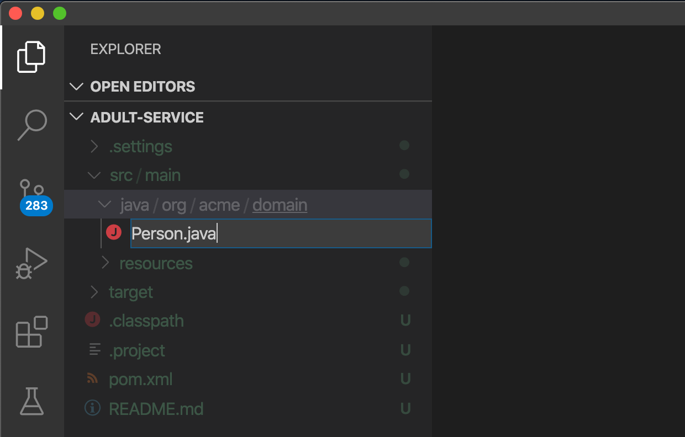
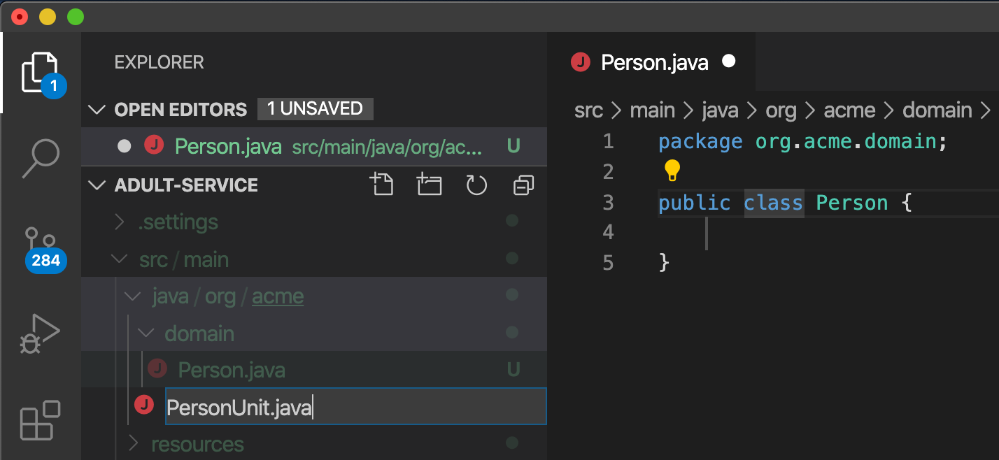
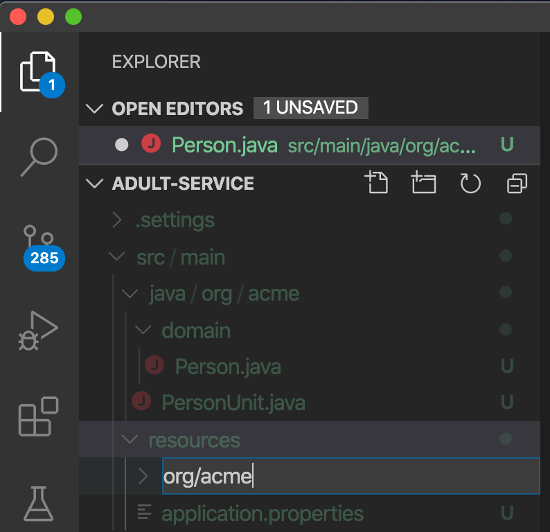

# What is Kogito?

{:width="400px"}

Kogito is Cloud Native Business Automation. Business Automation covers the application area of business processes, workflows, decisions, rules and optimization. Kogito brings these capabilities to the Cloud Native world by utilizing the latest innovations in the Java landscape, like \[Quarkus\](<https://quarkus.io>) and \[GraalVM\](<https://graalvm.org>), while building on battle-tested components.

## Goals of this Lab

-   Implement (business) rules in Kogito using RuleUnits.

-   Execute in you local environment.

## Prerequisites

-   Visual Studio Code

-   Kogito Tooling for Visual Studio Code

-   JDK 11+

-   Maven 3.6.3+

-   cURL (or another client/tool with which RESTful requests can be sent to the Kogito application)

-   GraalVM 20.x

In this step, you will create a Kogito application skeleton.

The application we will built is a decision microservice which determines whether a person is an adult.

We will implement these rules in DRL (Drools Rule Language), using the *rule unit* API and the *OOPath* rule syntax.

Let’s get started.

The easiest way to create a new Kogito project is to execute the Maven command in a terminal:

~~~
$ mvn archetype:generate -DinteractiveMode=false  -DarchetypeGroupId=org.kie.kogito  -DarchetypeArtifactId=kogito-quarkus-dm-archetype  -DarchetypeVersion=1.5.0.redhat-00004  -DgroupId=org.acme  -DartifactId=adult-service  -Dversion=1.0-SNAPSHOT
~~~

This will use the Kogito Maven Archetype and generate a basic Maven project for you in the `adult-service` subdirectory. The project consists of:

-   The Maven structure.

-   Example `Traffic Violation` DMN decision.

-   An OpenAPI Swagger-UI at `http://localhost:8080/swagger-ui`.

Once the project is generated, open the project in Visual Studio Code:

~~~
$ code adult-service  
~~~

The default Kogito application created from the archetype contains a sample process called `Traffic Violation.dmn`. We will remove this decision resource, as it is not required for our application. In your Visual Studio Code IDE, open the `src/main/resources` folder of the project and delete the `test-process.bpmn2` file.

{:width="800px"}

# Running the Application

We will now run the Kogito application in development mode. This allows us to keep the application running while implementing our application logic. Kogito and Quarkus will *hot reload* the application when it is accessed and changes have been detected.

Go back to your terminal (or open the integrated terminal in Visual Studio Code).

{:width="800px"}

Make sure that you’re in the root directory of the `adult-service` project (the directory containing the `pom.xml` file). We are ready to run our application. Run the following command to start the application in Quarkus development mode:

`$ mvn clean compile quarkus:dev`

When the application has started, you can access the [Swagger UI](http://localhost:8080/swagger-ui)

You should see the following page:

{:width="800px"}

It’s working!

You can now stop the application with `CTRL-C`.

# Congratulations!

You’ve seen how to create the skeleton of basic Kogito app, and start the application in *Quarkus dev-mode*.

In the previous step we’ve created a skeleton Kogito application with Quarkus and started the application in *Quarkus dev-mode*. In this step we create the domain model of our application.

# Facts

A (business) rules and/or decision service operates on entities called *facts*. *Facts* is data over which a rules engine reasons and to which it applies its constraints. In Kogito, facts are implemented as POJOs (Plain Old Java Objects).

Our *adult service* determines if a *person* is an adult based on his age.

From this description of our application, we can infer the *fact*:

-   Person: which has a name, an age, and a boolean that states whether he/she is an adult.

# Person

We first implement the `Person` class. To do this, we first need to create a new package in our project.

In your Visual Studio Code IDE, open the `src/main/java/org/acme` folder of the project, and create the folder `domain`.

In this package create a new `Person.java` file.

Implement this class as follows:

~~~
package org.acme.domain;

public class Person {

    private String name;
    
    private int age;
    
    private boolean adult;
    
    public Person() {
    }
    
    public String getName() {
        return name;
    }
    
    public void setName(String name) {
        this.name = name;
    }
    
    public int getAge() {
        return age;
    }
    
    public void setAge(int age) {
        this.age = age;
    }
    
    public boolean isAdult() {
        return adult;
    }
    
    public void setAdult(boolean adult) {
        this.adult = adult;
    }

} 
~~~

# Congratulations!

You’ve implemented the domain model of your Kogito business rules project. In the next step, we will implement the *RuleUnit* of our application.

*Rule Units* are groups of data sources, global variables, and DRL rules that function together for a specific purpose. You can use rule units to partition a rule set into smaller units, bind different data sources to those units, and then execute the individual unit.

# PersonUnit.

We first implement the skeleton of our `PersonUnit` class. To do this, we first create a new `PersonUnit.java` file in the `org.acme` package in `src/main/java`

Implement this new `PersonUnit` class as follows:

~~~
package org.acme;

import org.acme.domain.Person; 
import org.kie.kogito.rules.DataSource;
import org.kie.kogito.rules.DataStore; 
import org.kie.kogito.rules.RuleUnitData;

public class PersonUnit implements RuleUnitData {

//Add Person DataStore here

//Add adultAge variable here

    public PersonUnit() {

    }

//Add DataStore Getters and Setters here

//Add adultAge Getters and Setters here
} 
~~~

Notice that the class is not fully implemented yet. We will add the additional logic now.

We now need to create our `DataSource` for our `Person` facts. A `DataSource` provides us with a typed API to add *facts* to our unit. Kogito provides a number of different `DataSources` types, for example a `DataStore`, which allows users to insert, update and remove facts, and a `DataStream` that only allows to append facts to a stream.

In this example we will be using the `DataStore` implementation for our `Person` facts. We therefore add a private `DataStore` variable to our rule unit. We use the `DataSource` factory class to create a new `DataStore` instance and assign it to the variable. Add the following code snippet to the `PersonUnit.java` class, at the place of the `//Add Person DataStore here` comment:

~~~
private DataStore <Person> persons = DataSource.createStore(); 
~~~

We also create the *getters and setters* for our store. Add the following code snippet to the `PersonUnit.java` class, at the place of the `//Add DataStore Getters and Setters here` comment:

~~~
public DataStore<Person> getPersons() { return persons; }

public void setPersons(DataStore<Person> persons) {
this.persons = persons;
}
~~~

That’s it for now. We will implement some additional functionality to this unit later in this lab.

# Congratulations!

In this step you’ve implemented your first *Rule Unit*. Well done! In the next step we will implement the rules and queries of our rule unit.

The rules of our rule unit will be implemented in DRL, the Drools Rule Language. DRL is a declarative language in which advanced rules can be defined and implemented, using constructs like rules, functions and queries.

# PersonUnit DRL

We first implement the skeleton of our `PersonUnit.drl` file in the `src/main/resources` directory of our project.

First we create the proper package in our `src/main/resources` folder. In VSCode, add the directory `org/acme` to your `src/main/resources` folder.

Next, we create the DRL file by clicking. Add a new file with the name `PersonUnit.drl` to the `org.acme` package in the `src/main/resources` folder of your project.

Implement this DRL file as follows:

~~~ 
package org.acme;
//Unit definition

import org.acme.domain.Person;

rule "Is Adult"
when
//Person OOPath
then
//Set adult
end

query "adult"
//Adult query
end
~~~

We first need to define that this `PersonUnit.drl` is connected to our `PersonUnit`. We do this through `unit` definition under the `package` definition at the top of the DRL file: Add the following DRL snippet to the `PersonUnit.drl` file, at the place of the `//Unit definition` comment:

~~~
unit PersonUnit; 
~~~

Next, we implement the constraint, or left-hand-side of our rule. We will do this in the *OOPath* syntax. *OOPath* allows us to write constraints in an XPath-like syntax, allowing users to more easily navigate object hierarchies when writing rules. Also, it allows us to easily define constraints using the rule unit `DataSource` paradigm.

The following constraint matches `Person` facts from the `persons` datastore of our unit, who’s age is equal to, or greater than 18. Add this snippet to the DRL file, at the place of the `//Person OOPath` comment.

~~~ 
$p: /persons[age >= 18]; 
~~~

We can now implement the consequence of our rule, or the right-hand-side (RHS). This the action that will be executed when the rule fires. In our case we want to set the person’s `adult` field to true when the rule fires. Add this snippet to the DRL file, at the place of the `//Set adult` comment.

~~~ 
$p.setAdult(true); 
~~~

The next thing we need to do for our Kogito application is a query. The query in a unit’s DRL, in combination with the rule unit definition, is used by the Kogito code generator to automatically generate the RESTful endpoint for our application. In this query, we simply want to return all the facts from our `persons` datastore. Add this snippet to the DRL file, at the place of the `//Adult query` comment.

~~~ 
$p: /persons;
~~~

This completes the initial implementation of our DRL.

# Running the application

With our domain model, rule unit and rules implemented, we can now start our application. In a terminal, execute the following Maven command.

`$ mvn clean compile quarkus:dev`

We can inspect the generated RESTful endpoint in the [Swagger-UI](http://localhost:8080/swagger-ui) of the application.

We can now send a request to our generated RESTful endpoint using cURL:

`$ curl -X POST "http://localhost:8080/adult" -H "accept: application/json" -H "Content-Type: application/json" -d "{\"persons\":[{\"age\":18,\"name\":\"Jason\"}]}"`

You should see the following result, showing that Jason is an adult:

~~~
$ [{"name":"Jason","age":18,"adult":true}]

~~~

Stop the application in the first terminal using `CTRL-C`.

# Congratulations!

In this step you’ve implemented your first Kogito rules and queries. You’ve seen how Kogito automatically generates the RESTful microservice for you using your business assets, like your rule unit and rules definitions. Finally, we’ve started our application in Quarkus dev-mode, and fired a request.

Apart from using `DataSources` in our rule units to insert, update and delete facts, we can also define variables in our unit that can be used in our rules. In this use-case we will add an `adultAge` variable to our unit, which allows us to send the age at which a person is considered an adult in our request, and using that age in our rules.

# PersonUnit DRL

First, we add a new `adultAge` variable to our `PersonUnit` class. Open the `PersonUnit.java` file and add the following code snippet at the `//Add adultAge variable here` comment.

~~~
private int adultAge; 
~~~

We also add the *getters and setters*. Add these at the `//Add adultAge Getters and Setters here` comment in the `PersonUnit.java` class.

~~~
  public int getAdultAge() {
      return adultAge;
  }

  public void setAdultAge(int adultAge) {
      this.adultAge = adultAge;
  }
~~~

With our variable implemented, we can now use this variable in our rules. Open the `PersonUnit.drl` file, and replace the constaint of the rule (`$p: /persons[age >= 18];`) with the following constraint, which replaces the hardcoded age `18` with our variable:

~~~ 
$p: /persons[age >= adultAge]; 
~~~

We’ve now added the functionality we want, so we can start our application again. Execute the following Maven command in a terminal:

~~~
$ mvn clean compile quarkus:dev
~~~

We can now hit the application with a request that contains our new `adultAge` variable:

~~~
$ curl -X POST "http://localhost:8080/adult" -H "accept: application/json" -H "Content-Type: application/json" -d "{\"adultAge\": 21, \"persons\":[{\"age\":18,\"name\":\"Jason\"}]}"
~~~

This will give you the following result:

~~~
$ [{"name":"Jason","age":18,"adult":false}]
~~~

Notice that, because we have defined the `adultAge` to be 21, Jason is no longer considered an adult.

A Kogito Quarkus application running in Quarkus dev-mode automatically exposes an OpenAPI specification of its RESTful resources through a Swagger-UI. You can open this Swagger-UI [using this link](http://localhost:8080/swagger-ui).

Open the **POST /adult** RESTful endpoint. Note that a fully typed API is generated for you, based on your business assets like your rule units and rules.

# Congratulations

You have created a new kogito application where you can deliver business rules automation using DRL and the Rule Units concept.
